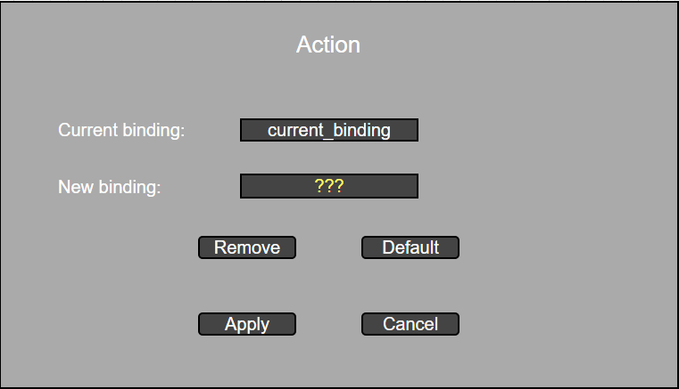
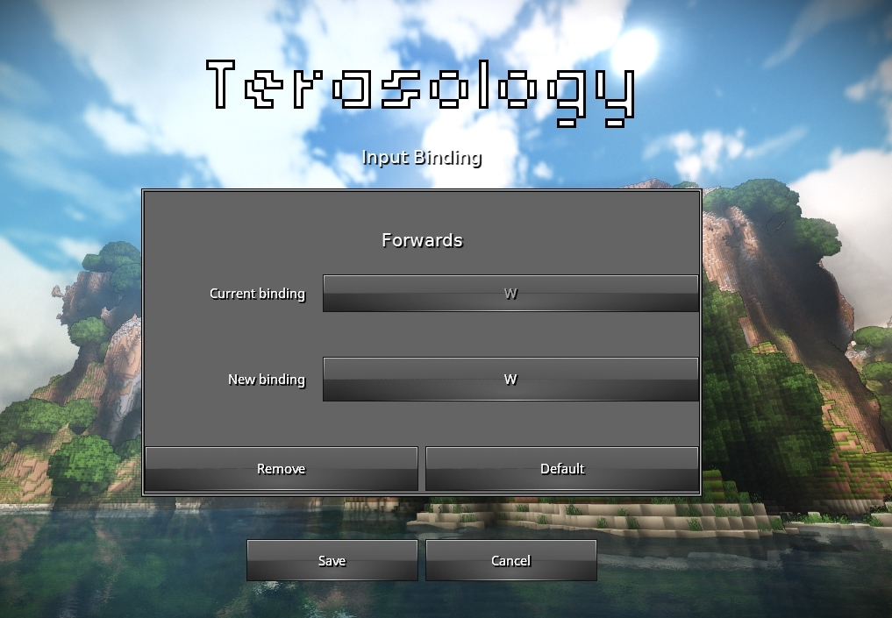

## Terasology - Software Evolution

### Feature Identification

If we check Terasology's [issues forum](https://github.com/MovingBlocks/Terasology/issues/), we can see that there are several issues that need attention, or features that the main developers would like to see developed (as mentioned in previous reports). After analysing the forum, our group decided to implement one of the features the main developers consider crucial for Alpha Release - that being issue [#1568](https://github.com/MovingBlocks/Terasology/issues/1568). 

The issue consists in adding an easy way to unbind keybindings. The game currently has a way of restoring all keys to their default binding, but, if the user thinks they don't need a function or don't want to use keyboard space, there is currently no easy way of doing that.

With this in mind, we posted in the issue our proposed strategy to implement this feature. After some discussion, we figured that the best solution for this would be implementing a modal window, since it didn't remove one key from the bindable keys (like the original suggestion of using the Escape key) or wouldn't be confusing for the user (as the clicking with the mouse right button to enable binding/unbinding mode was). This modal box will also allow the user to preview their binding before applying, and cancelling their changes.

We then proceeded to produce a mockup with our suggested implemention, which was approved by [Cervator](https://github.com/Cervator). We then began the implementation of the feature. The following picture represents the mockup we produced:

### Feature implementation and pull request issuing

After that, some study and searching was made in order to understand the project's way to create a new GUI element and to manage the keybindings.
The final result can be seen here:

After finishing its implementation, we issued pull request [#2060](https://github.com/MovingBlocks/Terasology/pull/2060), which is currently awaiting to be accepted.
